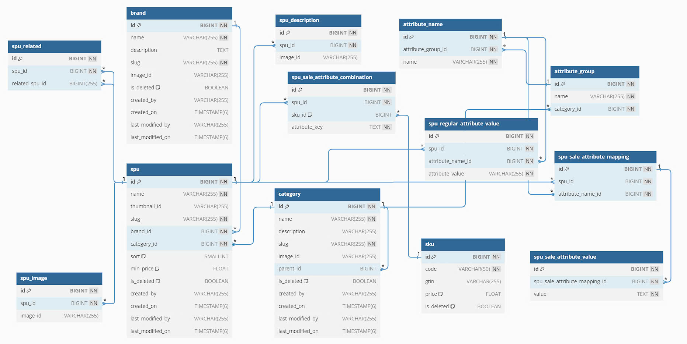
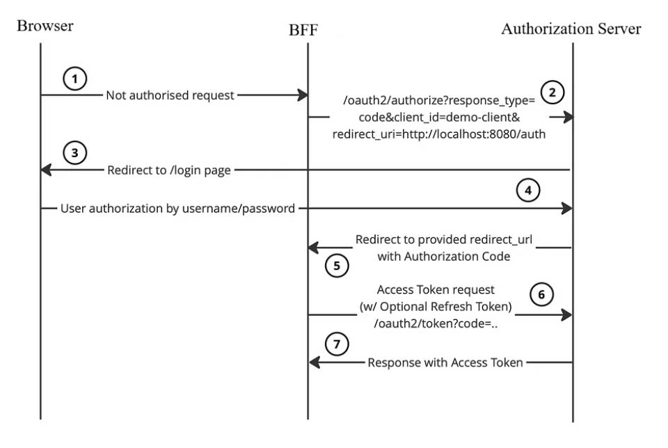

# E-commerce Backend

This project is for research and learning purpose about system design in ecommerce domain.

## Tech Stack

- Java 22
- Spring Boot 3.3
- MySQL
- I18n (Internationalization)
- Redis
- Apache Kafka
- Debezium
- Elasticsearch
- Amazon Web Services (S3, CloudFront)

## Getting started

* **Note**: There are some private configurations related to S3 and cloudfront that I don't want to share, so I hid the main config files, and left the sample config file

1. Get the latest source code.
2. Open ubuntu terminal, go to ecom directory.
3. Run `sh start.sh` and wait util it finishes.
4. Run `sh start-connector.sh`.

## Explanations
### 1. SPU and SKU design
* **SPU**: It is a type of products, like Iphone 15
* **SKU**: It is a specific product unit based on the SPU, like Iphone15 + 512GB, Iphone 15 + 1024GB. It is a combination of sale attributes
* **Sale Attribute**: The different attribute values of the sale attributes of a product will lead to differences in the price
* **Regular Attribute**: It will not affect the price of the product

* An example of an api endpoint relevant to this design: [Link](example/spu_example_api.json)

### 2. BFF Pattern, OAuth2 + PKCE
* **Two basic authentication approaches**
  * **Cookies-based authentication(Stateful)**
    * The advantages:
      - It can prevent XSS attacks on our application to steal them
      - Cookies are automatically managed by the browser, JS can't read them
    * The drawbacks:
      - Cookies is not friendly with REST APIs
      - It can't prevent from CSRF attacks
  * **Token-based authentication(Stateless)**
      * The advantages:
        - Token is friendly with REST APIs
        - It can prevent from CSRF attacks
      * The drawbacks:
        - It can't prevent from XSS attacks because JS can read them
  * **==> Which is the good  option for authenticating SPA? It is a combination of both with BFF pattern.**
* **BFF Server**: The Backend for Frontend (BFF) server serves as an reverse proxy between the frontend and various backend services. It is responsible for aggregating and adapting data from multiple sources to the frontend’s needs.
* **Authorization Server**: The server that handles user authentication and issues OAuth2 tokens. It verifies user credentials and issues access tokens that are used to access protected resources. The authorization server supports PKCE (Proof Key for Code Exchange) to save **code** to enhance security
* **Resource Server**: The server that provides APIs.

* **Authorization Code Flow without PKCE**

* PKCE encrypt the Authorization Code from Authorization server to enhance security.

* **Benefits**: 
  - Save cookies in the browser, BFF server will rely on cookies to get access tokens from BFF Session to communicate with other services. It ensures high security of cookies and flexibility of tokens in communication.
* In this project, I use Redis to store sessions to ensure that user sessions are not lost if the server goes down. I also use Spring Webflux (reactive programming), in a normal way, each api call will create 1 thread, nad if too many threads are generated, the operating system would spend more time on context switching, 

* Because of learning purpose, I have not completed some functions including registration, here are 2 available accounts
  * Role User
    - username: user@example.com
    - password: pass
  * Role Admin
      - username: admin@example.com
      - password: pass
### 3. Sync data from MySQL to Elasticsearch with CDC
* To be updated soon
### 4. Use AWS Cloudfront Signed Url for secure image
* To be updated soon
